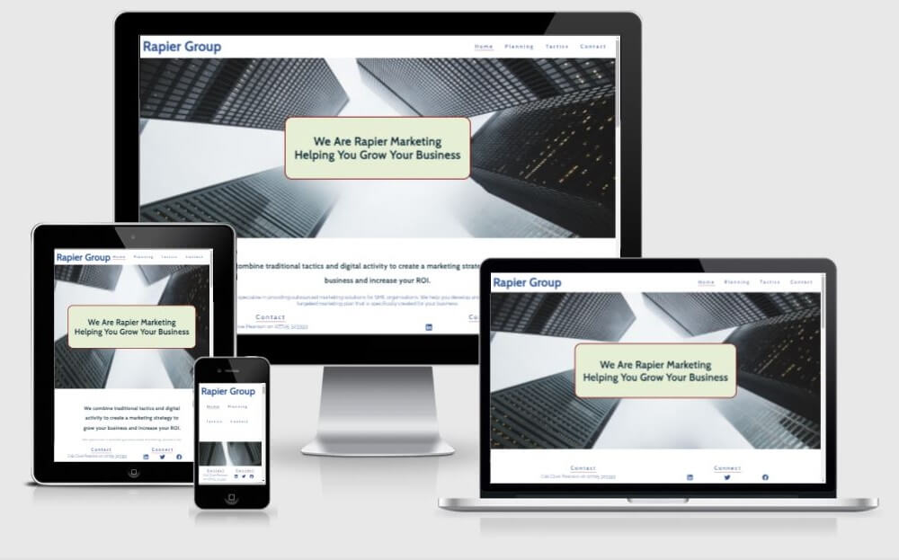
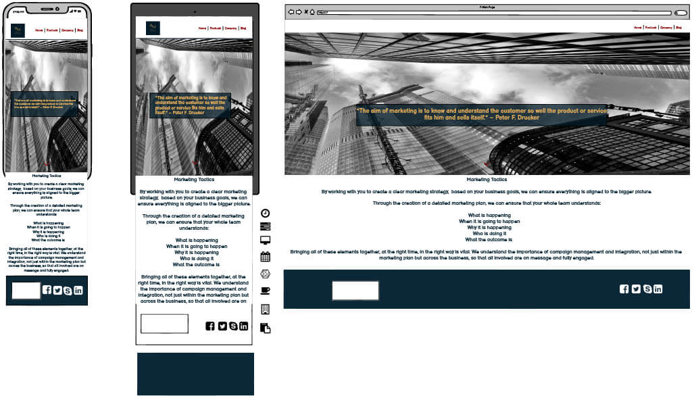

# MS1 Project - Rapier Marketing

** **
### **Table of Contents**

** **

*   [Overview](#overview)
*   [UX](#ux)
*   [Design](#design)
*   [Features](#features)
*   [Testing](#testing)
*   [Technologies Used](#technologies-used)
*   [Deployment](#deployment)
*   [Credits](#credits)
*   [Acknowledgements](#acknowledgements)
*   [Support](#support)

** **

### **Overview**

** **

This is the first Milestone Project for the **Full Stack Web Development Diploma** from [Code Institute](https://codeinstitute.net).

This website is a real-life client project for Clive Pearson of Rapier Marketing Services.  Clive is a marketing consultant specialising in SMEs and micro businesses.

This website has been built using the knowledge gained from the HTML, CSS and User Centric Design modules of Code Institute's FullStack Web Development course.

[The live version of the website can be found here](https://kat632.github.io/MS1-Rapier-Marketing/).

This is what the Home page of the website looks like on various different devices.

This is what the Planning page of the website looks like on various different devices.

This is what the Tactics page of the website looks like on various different devices.

This is what the Contact page of the website looks like on various different devices.

** **

[Return to Table of Contents](#table-of-contents)

** **

### **UX**

** **

**1. Strategy**

To ensure the UX is simple and user-friendly, by providing easy navigation through all pages on the site.

### **User stories**

**Visitor Goals**

*	As a website visitor, I want to easily understand the main purpose of the website and learn more about the organisation.

*	As a website visitor, I want to be able to easily navigate through the site to find content.

*	As a website visitor, I want to be able to view the website clearly on any mobile device.

*	As a website visitor, I want to know what services are provided by the organisation.

*	As a website visitor, I would like to see examples of previous projects undertaken by the organisation.

**Client Goals**

*	To have a more visually pleasing website than the current version [https://rapiergroup.co.uk/](https://rapiergroup.co.uk/).

*	To minimise the risk of information overload, by condensing the text into a more readable layout.

* 	The website must represent the client and their business in a professional manner.  No visual gimmicks or massive menus.

**2. Scope**

*	To create a fluid and responsive layout for ease of use on common devices.

*	To fine-tune and implement the skills I have learnt so far on my course.

**3. Structure**

I designed this website to create a more modern and eye-catching version of the original website.  See above for link to original website.  The original website was built by Clive Pearson using a Wordpress template.  My version of the website utilises modern internet protocols to create a more aethetically pleasing experience for the user.

**4. Skeleton**

*	Wireframes - please see below in the Design section.

*	Fixed footer for the purpose of a strong and constantly present Call To Action.

*	Home page, Planning page, Tactics page, Contact page.

**5. Surface**

Please see Design section below.

** **

[Return to Table of Contents](#table-of-contents)

** **

### **Design**

** **

**Colour Scheme**

Rapier Marketing Services is named after the owner's father, Ray Pearson.  Ray is a Chelsea Pensioner and so the colour scheme of the website has been chosen to relect the colours of the Chelsea Pensioner uniform.  Clive also specified that he wanted to keep the blue colour #2F5596 of his existing logo.  I used [Coolors](https://coolors.co) to create a pallette that I thought would work well with the professional look required by the client.

I used EightShapes Contrast Grid to test the foreground and background colour combinations for minimum contrast compliance.

**Typography**

The website uses two fonts throughout.  The headers throughout the website are using the **Cabin** font while the main text is using the **Raleway** font.  Both fonts are from [Google Fonts](https://fonts.google.com/).  The fonts were chosen for their simplicity and because I am aware that sans serif fonts are better for dyslexic readers.  My information about choosing an accessible font came from [this article at Bdadyslexia](https://www.bdadyslexia.org.uk/advice/employers/creating-a-dyslexia-friendly-workplace/dyslexia-friendly-style-guide).

**Imagery**

Brand is important to Rapier Marketing and I wanted to ensure consistency throughout the site.  The hero images have are all of tall buildings or skyscrapers because I wanted to convey a feeling of 'reaching for the sky' and I like the sense of corporate ambition that skyscrapers represent.

The images in the Past Projects Gallery have been provided by the client.  I would have preferred certainly the bottom row of corporate literature and brochures to be higher resolution, but unfortunately they had to be converted from pdfs and I couldn't make them any better quality.  I used [Adobe PDF Convertor](https://www.adobe.com/uk/acrobat/online/convert-pdf.html) to convert the pdfs.

The images in the Testimonials section were taken from Linkedin with the kind permission of their owners.

**Wireframes**

*index.html*

*planning.html*

*tactics.html*

*contact.html*

**Differences to Design**

*   In the original design, there were two buttons over the hero image on the home page that were meant to link to either further down the page, or to take you to a different page.  I realised that adding these buttons was not going to enhance the navigation of the site, but rather confuse it.

*   I added colour to the wireframes in order to show them to the client.  Having seen the wireframes, the client requested that his blue colour #2F5596 be used, that he wanted more white space and that I was not to use too much red in the scheme because he feels it can be seen negatively and convey the wrong message.  This is why in the finished version of the website, the What We Do and Testimonial boxes on the home page are now all blue.

*   There are random icons on the wireframe images too because I was discussing which ones to use with the client and I forgot to remove them before I took the screenshots.

*   On the advice of my mentor, I made the text boxes over the top of the hero images lighter and with a solid background because there was not enough contrast.

*   There is a gold colour on the wireframes that I was going to use as part of the colour scheme, but I changed my mind because gold is not a colour you often see on corporate websites.

**Limitations**

Due to no JavaScript functionality, apart from the Back-To-Top button as outlined in the Features section, the contact form will not store data or send emails.

** **

[Return to Table of Contents](#table-of-contents)

** **

### **Features**

** **

*   This is a four page website: Home, Planning, Tactics and Contact.
*   Each page has a site navigation bar at the top.
*   The logo in the top left of each page will also take you back to the home page.
*   Each page has a sticky footer with the contact details and social media icons for Rapier.  I felt that a sticky footer was a strong and always present call-to-action.

*   The home page has three sections: **What We Do** which briefly explains what the company does.  **Past Projects** which showcases some of the company's previous work.  The images in this section are clickable and will open in a new tab.  **Testimonials** which has three testimonials from people the company has worked with in the  past.
*   The home page has a Back-to-Top button because I felt it needed to for functionality.  The page is quite long and a mouse user would have to do quite a lot of scrolls to get back to the top of the page.  I could have made the navigation bar sticky, but I didn't want to have both the header and footer be sticky.  Alternatively, I could have put the navigation in the footer, but I didn't want the footer to be too big.

**Responsive features**

*   The **Past Projects** gallery will go into two columns and then one column on smaller screens.
*   The **What We Do** and **Testimonials** sections will stack on top of each other on smaller screens.
*   The table on the **Tactics** page will shrink on smaller screens and will go into one long list at less than 600px.
*   The **Contact** page will stack into a column on smaller screens.

**Features Left to Implement**

In the future I would like to find a way to make this into a concertina dropdown for each heading instead of a big long list, but I was concerned about how long it would take to get it to work properly, especially being limited to HTML and CSS.

** **

[Return to Table of Contents](#table-of-contents)

** **

### **Testing**

** **

Testing has been carried out using the following web services:

*   HTML on all pages, tested clear on DAtE/TIME [The W3C Markup Validation Service](https://validator.w3.org/)

*   CSS, tested clear on DAtE/TIME [The W3C CSS Validation Service](http://jigsaw.w3.org/css-validator/)

*   All pages pass through [Google Lighthouse](https://developers.google.com/web/tools/lighthouse) with no major concerns, except for the empty values in the aria-required labels on the form fields.  These have been changed to aria-required="true".

*   Accessibility testing using [WebAim Wave - Web Acessibility Evaluation Tool](https://wave.webaim.org/)

No further changes to the code have been made since the above dates and times.

** **

[Return to Table of Contents](#table-of-contents)

** **

### **Technologies Used**

** **

*	HTML - This project uses HTML as the main language used to complete the structure of the website.

*	CSS - This project uses custom written CSS to style the website.

*	[Font Awesome](https://fontawesome.com/) - Font awesome Icons are used for the What We Do information boxes on the home page and the social media links contained in the Footer section of the website.

*   [Google Fonts](https://fonts.google.com/) - Google fonts are used throughout the project to import the Libre Baskerville and Cabin fonts.

*   [Google Chrome Developer Tools](https://developers.google.com/web/tools/chrome-devtools) - Google chromes built in developer tools are used to inspect page elements and help debug issues with the site layout and test different CSS styles.

*   [balsamiq Wireframes](https://balsamiq.com/wireframes/) - This was used to create wireframes for 'The Skeleton Plane' stage of UX design.

*   [MS PAINT](https://support.microsoft.com/en-us/windows/get-microsoft-paint-a6b9578c-ed1c-5b09-0699-4ed8115f9aa9) - For cropping and resizing images.

*   [Favicon](https://favicon.io/) - Favicon.io was used to make the site favicon.

*   [AmIReponsive](http://ami.responsivedesign.is/) - This was used to make the multi device mockup in the README.

*   [Adobe PDF Convertor](https://www.adobe.com/uk/acrobat/online/convert-pdf.html) - to convert the pdfs in the image gallery to jpg.

** **

[Return to Table of Contents](#table-of-contents)

** **

### **Deployment**

** **

GitPod was used to write all code in this repository and pushed via Git to GitHub.

**Using Git Hub Pages**

*   Navigate to the gitHub [Repository](https://github.com/Kat632/MS1-Rapier-Marketing):
*	Click the 'Settings' Tab.
*	Scroll down to the GitHub Pages heading.
*	Click the Save button.
*	Click the link to go to the live deployed page.

**Run Locally**

*   Navigate to the GitHub Repository:
*	Click the Code drop down menu.
*	Either Download the ZIP file, unpackage locally and open with IDE (This route ends here) OR Copy Git URL from the HTTPS dialogue box.
*	Open your developement editor of choice and open a terminal window in a directory of your choice.
*	Use the 'git clone' command in terminal followed by the copied git URL.
*	A clone of the project will be created locally on your machine.

** **

[Return to Table of Contents](#table-of-contents)

** **

### **Credits**

** **

**Media**

*   Brand Logo and Favicon from Canva [canva.com](https://www.canva.com/)
*	Home page image from Pixabay [pixabay.com](https://pixabay.com/)
*   The other two hero images are from Pexels [pexels.com](https://pexels.com)
*   All other images have been provided by the client.
 
**Content**

*   All text on the site is adapted from the original website.

	[https://rapiergroup.co.uk/](https://rapiergroup.co.uk/)

**Code Snippets**

*	Parallax scrolling code from W3Schools [https://www.w3schools.com/howto/howto_css_parallax.asp](https://www.w3schools.com/howto/howto_css_parallax.asp)

*	Responsive image gallery, adapted from code at W3Schools [https://www.w3schools.com/css/tryit.asp?filename=trycss_image_gallery_responsive](https://www.w3schools.com/css/tryit.asp?filename=trycss_image_gallery_responsive)

* Responsive table, adapted from code related to this article at CSS Tricks [https://css-tricks.com/accessible-simple-responsive-tables/](https://css-tricks.com/accessible-simple-responsive-tables/)

*	Form styling, from code at W3Schools [https://www.w3schools.com/css/css_form.asp](https://www.w3schools.com/css/css_form.asp)

*	The code for the Back To Top button on index.html was copied from W3Schools [https://www.w3schools.com/howto/howto_js_scroll_to_top.asp](https://www.w3schools.com/howto/howto_js_scroll_to_top.asp)

** **

[Return to Table of Contents](#table-of-contents)

** **

### **Acknowledgements**

** **

I would like to thank:

*	My mentor [Adegbenga Adeye](https://github.com/deye9).

*	The members of my Retro Hackathon team for their encouragement and advice during my first project: [Andrew Dempsey](https://github.com/andrewdempsey2018), [Helena Johansson](https://github.com/Odden69), [John Doyle](https://github.com/Aramantos), [Patrik Österljung](https://github.com/oljung), [Yorick van den Hurk](https://github.com/nowane).

*   Jo at **Code Institute** tutor support for advising me about my broken image gallery 15/09/21.

** **

[Return to Table of Contents](#table-of-contents)

** **

### **Support**

** **

If you require any help or assistance you may contact me on 

katherine.biggs@mail.com